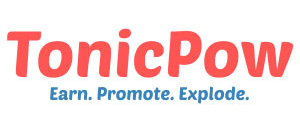
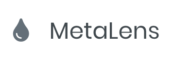

# BitCoin [Schema](https://bitcoinschema.org)
Community driven extensible schemas that enable developers to create interoperable data based applications. View [schema in action](https://map.sv/).

[](https://github.com/bitcoinschema/schema/commits/master)
[](https://github.com/bitcoinschema/schema/releases)
[](/LICENSE)
[](https://github.com/RichardLitt/standard-readme)
[](https://atlantistic.slack.com/app_redirect?channel=schema)

## Table of Contents
- [About](#about)
- [Installation](#installation)
- [Documentation](#documentation)
- [Examples](#examples)
- [Code Standards](#code-standards)
- [Usage](#usage)
- [Maintainers](#maintainers)
- [Contributing](#contributing)
- [License](#license)

## About
Standing on the shoulders of giants, our idea was inspired by the [Schema.org](https://schema.org) project.
(more to come...)

### What is Schema?
[Read more here](https://bitcoinschema.org)

## Installation
This project uses [gulp](https://gulpjs.com/) for workflow automation and [docsify](https://docsify.js.org) for the documentation generation and hosting.

Install all npm packages
```bash 
$ cd /projects/schema
$ npm install   
```    

Serve the docs via `localhost:port`
```bash
$ npm run start
``` 

See more scripts in the [package.json](package.json) file

## Documentation
Visit [our live documentation](https://bitcoinschema.org) site.

## Examples
Websites or applications using Schema:
- [map.sv](https://map.sv/)
- [TonicPow](https://tonicpow.com/)

## Code Standards
Please read our [standards document](CODE_STANDARDS.md)

## Usage
Here's the [getting started](https://bitcoinschema.org/) with schema

## Maintainers
[Satchmo](https://github.com/rohenaz) - [MrZ](https://github.com/mrz1836) 

Support the development of this project and the [Schema](http://bitcoinschema.org/) team 🙏

## Contributing
Feel free to dive in! [Suggest a new schema](https://github.com/bitcoinschema/schema/issues/new/choose) or submit PRs.

Open source tools that we used in this project:
- [docsify](https://docsify.js.org) - A magical documentation site generator
- [mythbusters js](https://github.com/Kikobeats/js-mythbusters) - Professional deployment of docsify

## Contributors
Contribute today and join the team!

| [](https://mrz1818.com/) | [](https://github.com/rohenaz) |
|:---:|:---:|:-:|
| [MrZ](https://mrz1818.com/) | [Satchmo](https://github.com/rohenaz)  |


## Sponsors
Are you interested in becoming a sponsor of Schema? [Let us know!](https://github.com/bitcoinschema/schema/issues/new/choose)

| [](https://tonicpow.com/)  | [](https://metalens.app/)  | [](https://allaboardbitcoin.com)  |
|:---:|:---:|:---:|:---:|
| [TonicPow](https://tonicpow.com/)  | [MetaLens](https://metalens.app/)  | [All Aboard](https://allaboardbitcoin.com/)  |


## License
[](/LICENSE)
