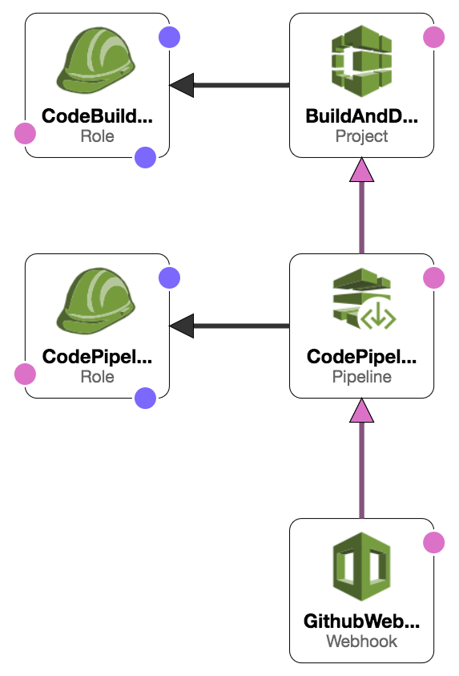

# BitCoin [Schema](https://bitcoinschema.org)
Community driven extensible schemas that enable developers to create interoperable data based applications. View [schema in action](https://map.sv/).

[](https://github.com/bitcoinschema/schema/commits/master)
[](https://github.com/bitcoinschema/schema/releases)
[](/LICENSE)
[](https://bitcoinschema.org)
<br>
[](https://mergify.io)
[](https://github.com/sponsors/BitcoinSchema)
[](https://atlantistic.slack.com/app_redirect?channel=schema)

## Table of Contents
- [About](#about)
- [Installation](#installation)
- [Deployment & Hosting](#deployment--hosting)
- [Documentation](#documentation)
- [Examples](#examples)
- [Code Standards](#code-standards)
- [Usage](#usage)
- [Maintainers](#maintainers)
- [Contributing](#contributing)
- [Sponsors](#sponsors)
- [License](#license)

## About
Standing on the shoulders of giants, our idea was inspired by the [Schema.org](https://schema.org) project.
`(more to come...) @Satchmo` 

<br />

### What is Schema?
[Read more here](https://bitcoinschema.org)

<br />

## Installation
This project uses [gulp](https://gulpjs.com/) for workflow automation and [docsify](https://docsify.js.org) for the documentation generation and hosting.

Install all npm packages
```bash
$ make install
```   

Serve the documentation via `localhost:port` e.g. `http://localhost:4000`
```bash
$ make start
``` 

See more scripts in the [package.json](package.json) file or the [makefile](Makefile).

<br />

### Deployment & Hosting
This repository has CI integration using [AWS CodePipeline](https://aws.amazon.com/codepipeline/).

The build in AWS will deploy to [firebase](https://firebase.google.com).

The actual build process can be found in the [buildspec.yml](buildspec.yml) file.

The application relies on [AWS Secrets Manager](https://aws.amazon.com/secrets-manager/)
and [AWS SSM](https://aws.amazon.com/systems-manager/features/) to store environment variables.
Sensitive environment variables are encrypted using [AWS KMS](https://aws.amazon.com/kms/) and then decrypted at runtime.

Deploy different environments by changing the `<stage>` to `production` or `development` as example.
The default stage is `production` if it's not specified.

<details>
<summary><strong><code>Firebase Hosting Setup</code></strong></summary>
<br/>

1) Start a new project and assign a CNAME
2) Make sure the region is us-central
3) Generate a CI `firebase_token` using the command: `firebase login:ci`
</details>

<details>
<summary><strong><code>Create Environment Encryption Key(s) (AWS)</code></strong></summary>
<br/>

Create a `KMS Key` per `<stage>` for your application(s) to encrypt environment variables
```shell script
make create-env-key stage="<stage>"
```

This will also store the `kms_key_id` in  [SSM](https://aws.amazon.com/systems-manager/features/) located at: `/<application>/<stage>/kms_key_id`

</details>

<details>
<summary><strong><code>Manage Environment Variables (AWS)</code></strong></summary>
<br/>

- `app_id` is the Firebase application id for the [project](https://firebase.google.com/docs/projects/learn-more)
- `project` is the [Firebase project_id](https://firebase.google.com/docs/projects/learn-more)
- `sender_id` is the Firebase sender_id for the [project](https://firebase.google.com/docs/projects/learn-more)

Add or update your project information _(all parameters are required)_
```shell script
make firebase-save-project \
      app_id="YOUR_APP_ID" \
      project="YOUR_PROJECT_ID" \
      sender_id="YOUR_SENDER_ID" \
      stage="<stage>";
```
</details>

<details>
<summary><strong><code>Manage Environment Secrets (AWS)</code></strong></summary>
<br/>

- `firebase_api_key` is found in the Firebase console for that specific project
- `firebase_token` is the `ci:login` token that is generated from `firebase login:ci`
- `github_token` is a personal token with access to make a webhook
- `kms_key_id` is from the previous step (Create Environment Encryption Keys)

Add or update your secrets _(all parameters are required)_
```shell script
make save-secrets \
      firebase_api_key="YOUR_FIREBASE_API_KEY" \
      firebase_token="YOUR_FIREBASE_CI_TOKEN" \
      github_token="YOUR_GITHUB_TOKEN" \
      kms_key_id="YOUR_KMS_KEY_ID" \
      stage="<stage>";
```
</details>

<details>
<summary><strong><code>Create CI Environment (AWS)</code></strong></summary>
<br/>



**Prerequisites**
- [An AWS account](https://aws.amazon.com/)
    - _Deploying_ requires permission to: [KMS](https://aws.amazon.com/kms/), [SSM](https://aws.amazon.com/systems-manager/features/), [Secrets Manager](https://aws.amazon.com/secrets-manager/) and [Cloud Formation](https://aws.amazon.com/cloudformation/)
- [AWS CLI](https://docs.aws.amazon.com/cli/latest/userguide/installing.html)  _(`brew install awscli`)_
- [SAM CLI](https://docs.aws.amazon.com/serverless-application-model/latest/developerguide/serverless-sam-cli-install-mac.html) _(`brew tap aws/tap && brew install aws-sam-cli`)_

This will create a new [AWS CloudFormation](https://aws.amazon.com/cloudformation/) stack with:
- (1) [CodePipeline](https://aws.amazon.com/codepipeline/) with multiple stages to deploy the application from Github
- (1) [CodePipeline Webhook](https://aws.amazon.com/codepipeline/) to receive Github notifications from a specific `branch:name`
- (1) [CodeBuild Project](https://docs.aws.amazon.com/codebuild/latest/userguide/create-project.html) to build and deploy the app
- (2) [Service Roles](https://docs.aws.amazon.com/IAM/latest/UserGuide/id_roles_create_for-service.html) for working with CodeBuild and CodePipeline

**NOTE:** Requires an existing S3 bucket for artifacts and sam-cli deployments (located in the [Makefile](Makefile))

One command will build, test, package and deploy the application to AWS.
After initial deployment, updating is as simple as committing to Github.
```shell script
make deploy
``` 

_(Example)_ Customized deployment for another stage
```shell script
make deploy stage="development" branch="development"
``` 

_(Example)_ Customized deployment for a feature branch
```shell script
make deploy stage="development" branch="some-feature" feature="some-feature"
```

_(Example)_ Customized S3 bucket location
```shell script
make deploy bucket="some-S3-bucket-location"
```

_(Example)_ Customized tags for the deployment
```shell script
make deploy tags="MyTag=some-value AnotherTag=some-value"
```  
</details>

<details>
<summary><strong><code>Tear Down CI Environment (AWS)</code></strong></summary>
<br/>

Remove the stack (using default stage: `production`)
```shell script
make teardown
```   

_(Example)_ Teardown another stack via stage
```shell script
make teardown stage="development"
``` 

_(Example)_ Teardown a feature/branch stack
```shell script
make teardown stage="development" feature="some-feature"
```   
</details>

<br/>

## Documentation
Visit [our live documentation](https://bitcoinschema.org) site.

<details>
<summary><strong><code>Release Deployment</code></strong></summary>
<br/>

[goreleaser](https://github.com/goreleaser/goreleaser) for easy binary or library deployment to Github and can be installed via: `brew install goreleaser`.

The [.goreleaser.yml](.goreleaser.yml) file is used to configure [goreleaser](https://github.com/goreleaser/goreleaser).

Use `make release-snap` to create a snapshot version of the release, and finally `make release` to ship to production.
</details>

<details>
<summary><strong><code>Makefile Commands</code></strong></summary>
<br/>

View all `makefile` commands
```shell script
make help
```

List of all current commands:
```text
audit                         Checks for vulnerabilities in dependencies
aws-param-certificate         Returns the ssm location for the domain ssl certificate id
aws-param-zone                Returns the ssm location for the host zone id
build                         Builds the package for web distribution
clean                         Remove previous builds and any test cache data
create-env-key                Creates a new key in KMS for a new stage
create-secret                 Creates an secret into AWS SecretsManager
decrypt                       Decrypts data using a KMY Key ID (awscli v2)
decrypt-deprecated            Decrypts data using a KMY Key ID (awscli v1)
deploy                        Build, prepare and deploy
encrypt                       Encrypts data using a KMY Key ID (awscli v2)
env-key-location              Returns the environment encryption key location
firebase-deploy-simple        Deploys to firebase with limited flags
firebase-get-env              Gets the current environment variables in the associated project
firebase-param-app-id         Returns the location of the app_id parameter in SSM
firebase-param-location       Creates a parameter location (for Firebase details in SSM)
firebase-param-project        Returns the location of the project-id parameter in SSM
firebase-param-sender-id      Returns the location of the sender_id parameter in SSM
firebase-save-project         Saves the firebase project information for use by CloudFormation
firebase-set-env              Set an environment variable in a firebase project
firebase-update               Update the firebase tools
help                          Show this help message
install                       Installs the dependencies for the package
invalidate-cache              Invalidates a cloudfront cache based on path
lint                          Runs the standard-js lint tool
outdated                      Checks for outdated packages via npm
package                       Process the CF template and prepare for deployment
release                       Full production release (creates release in Github)
release-snap                  Test the full release (build binaries)
release-test                  Full production test release (everything except deploy)
replace-version               Replaces the version in HTML/JS (pre-deploy)
save-domain-info              Saves the zone id and the ssl id for use by CloudFormation
save-param                    Saves a plain-text string parameter in SSM
save-param-encrypted          Saves an encrypted string value as a parameter in SSM
save-secrets                  Helper for saving sensitive credentials to Secrets Manager
start                         Start the documentation site
tag                           Generate a new tag and push (tag version=0.0.0)
tag-remove                    Remove a tag if found (tag-remove version=0.0.0)
tag-update                    Update an existing tag to current commit (tag-update version=0.0.0)
teardown                      Deletes the entire stack
test                          Runs all tests
update-secret                 Updates an existing secret in AWS SecretsManager
upload-files                  Upload/puts files into S3 bucket
```
</details>

<br />

## Examples
Websites or applications using Schema:
- [map.sv](https://map.sv/?utm_source=github&utm_medium=sponsor-link&utm_campaign=schema&utm_term=schema&utm_content=schema)
- [TonicPow](https://tonicpow.com/?utm_source=github&utm_medium=sponsor-link&utm_campaign=schema&utm_term=schema&utm_content=schema)

<br />

## Code Standards
Please read our [standards document](CODE_STANDARDS.md)

<br />

## Usage
Here's the [getting started](https://bitcoinschema.org/) with schema

<br />

## Maintainers
| [](https://github.com/mrz1836) | [](https://github.com/rohenaz) |
| :----------------------------------------------------------------------------------------------: | :--------------------------------------------------------------------------------------------------: |
|                                [MrZ](https://github.com/mrz1836)                                 |                                [Satchmo](https://github.com/rohenaz)                                 |

<br />

## Contributing
Feel free to dive in! [Suggest a new schema](https://github.com/bitcoinschema/schema/issues/new/choose) or submit PRs.

Open source tools that we used in this project:
- [docsify](https://docsify.js.org) - A magical documentation site generator
- [mythbusters js](https://github.com/Kikobeats/js-mythbusters) - Professional deployment of docsify

<br />

## Contributors
Contribute today and join the team!

| [](https://github.com/mrz1836) | [](https://github.com/rohenaz) |
| :----------------------------------------------------------------------------------------------: | :--------------------------------------------------------------------------------------------------: |
|                                [MrZ](https://github.com/mrz1836)                                 |                                [Satchmo](https://github.com/rohenaz)                                 |

<br />

## Sponsors
Are you interested in becoming a sponsor of Schema? [Let us know!](https://github.com/bitcoinschema/schema/issues/new/choose)

| [](https://tonicpow.com/)  | [](https://metalens.app/)  | [](https://allaboardbitcoin.com)  |
|:---:|:---:|:---:|
| [TonicPow](https://tonicpow.com/)  | [MetaLens](https://metalens.app/)  | [All Aboard](https://allaboardbitcoin.com/)  |

<br />

## License
[](/LICENSE)
